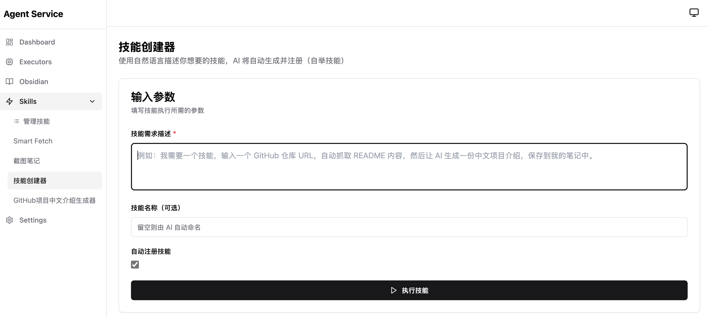

# Obsidian AI Workspace

AI 原生的智能工作空间。通过集成 AI Agent 和多种执行器，为 Obsidian 带来无限扩展可能。

实际上，本项目不仅限于 Obsidian —— 它可以服务于任何基于目录管理的笔记系统，甚至不限于笔记场景。得益于强大的 Claude Code 集成，任何需要 AI 增强的工作流都能在此落地。



## 功能特性

- **Agent Service** - NestJS 执行器管理器 + WebUI（端口 8000）
- **Obsidian 桌面应用** - 通过 noVNC 提供 Web 访问（端口 3000）
- **Claude Code Executor** - Claude Code CLI HTTP API 封装（端口 3002）
- **Playwright Executor** - 网页抓取服务（端口 53333）

## 核心功能：技能系统

技能系统是本项目的核心引擎，通过多步骤工作流串联不同执行器完成复杂任务。

### 技能创建器（自举机制）

**无需手动编写配置文件**，只需用自然语言描述你的需求，技能创建器会自动生成并注册技能。

例如，你可以这样描述：

> 我需要一个技能，输入一个 GitHub 仓库 URL，自动抓取 README 内容，然后让 AI 生成一份中文项目介绍，保存到我的笔记中。要支持配置笔记的保存目录。

系统会自动：
1. 分析需求，确定所需的执行器和步骤
2. 生成包含用户输入（仓库 URL、保存目录）的技能定义
3. 通过内置 `agent` 执行器一键注册到系统

这就是**自举机制**：技能可以创建技能，实现能力的自我扩展。

### 技能定义结构

技能由以下部分组成：

- **用户输入 (userInputs)** - 定义技能执行前需要用户提供的参数
- **内置变量 (builtinVariables)** - 如当前日期、随机 ID 等
- **执行步骤 (steps)** - 按顺序执行的动作链，每个步骤可引用前序步骤的输出

### 示例场景

- **网页剪藏** - 抓取网页内容 → AI 提炼摘要 → 保存为 Markdown 笔记
- **GitHub 项目介绍** - 抓取 README → 生成中文介绍和标签 → 归档到笔记库
- **截图笔记** - 网页截图 + 内容提取 → 生成图文混排笔记

## 快速开始

### 使用 Docker Compose（开发模式）

从源码构建运行：

```bash
git clone <repo-url>
cd obsidian-ai-workspace
mkdir -p vaults config

# 配置环境变量
cp .env.example .env
# 编辑 .env 文件，填入 ANTHROPIC_AUTH_TOKEN 等配置

# 构建并启动
docker compose up -d --build
```

### 使用预构建镜像（生产部署）

提供两种部署方案：

#### 完整版 (allinone)

包含 Obsidian 桌面应用 + 所有执行器。启动后：
- 通过 http://localhost:8000 访问 Agent Service WebUI，管理执行器和使用技能
- 通过 http://localhost:3000 访问网页版 Obsidian，首次使用需手动将 Vault 目录指向 `/vaults` 打开

```bash
cd deploy/allinone
cp .env.example .env
# 编辑 .env 文件，配置 ANTHROPIC_AUTH_TOKEN（API Key）、ANTHROPIC_BASE_URL（API 地址）、CLAUDE_DEFAULT_MODEL（默认模型）等

docker compose up -d
```

#### 无界面版 (headless)

仅 Agent 服务和执行器，不含 Obsidian 桌面应用。适用于已有本地 Obsidian 或仅需 AI 执行器能力的场景。

启动后通过 http://localhost:8000 访问 Agent Service WebUI。

```bash
cd deploy/headless
cp .env.example .env
# 编辑 .env 文件，配置 ANTHROPIC_AUTH_TOKEN（API Key）、ANTHROPIC_BASE_URL（API 地址）、CLAUDE_DEFAULT_MODEL（默认模型）等

docker compose up -d
```

## 架构

```
┌─────────────────────────────────────────────────────────────────┐
│                       Agent Service (:8000)                     │
│              NestJS - Executor Manager + WebUI                  │
└────────────────────────────┬────────────────────────────────────┘
                             │ manages/monitors
        ┌────────────────────┼────────────────────┐
        ▼                    ▼                    ▼
┌─────────────────┐  ┌─────────────────┐  ┌─────────────────┐
│    Obsidian     │  │ Claude Code     │  │   Playwright    │
│  (linuxserver)  │  │   Executor      │  │   Executor      │
│     :3000       │  │     :3002       │  │    :53333       │
└────────┬────────┘  └────────┬────────┘  └────────┬────────┘
         │                    │                    │
         └────────────────────┴────────────────────┘
                              │
                        ./vaults (shared)
```

## 配置说明

复制 `.env.example` 到 `.env` 并配置：

| 环境变量 | 说明 | 默认值 |
|----------|------|--------|
| ANTHROPIC_AUTH_TOKEN | Claude API Key | 空 |
| ANTHROPIC_BASE_URL | API Base URL（可选） | 空 |
| CLAUDE_DEFAULT_MODEL | 默认模型 | claude-sonnet-4-5-20250929 |
| PUID | 用户 ID | 1000 |
| PGID | 组 ID | 1000 |
| TZ | 时区 | Asia/Shanghai |

## 端口映射

| 端口 | 服务 |
|------|------|
| 8000 | Agent Service (执行器管理 + WebUI) |
| 3000 | Obsidian noVNC Web 界面 |
| 3002 | Claude Code Executor API |
| 53333 | Playwright Executor |

## 目录挂载

- `./vaults` - 共享 Vault 目录（挂载到所有容器的 `/vaults`）
- `./config` - Obsidian 配置（插件、主题、设置）
- `./agent-service/config` - 执行器配置（YAML）

## 开发计划

- [x] 基础镜像（Obsidian Web 访问）
- [x] Agent Service（执行器管理 + WebUI）
- [x] Claude Code Executor
- [x] Playwright Executor
- [ ] 更多 AI Agent 集成

## 致谢

本项目的实现得益于以下优秀的项目和服务：

- [Obsidian](https://obsidian.md/) - 强大的本地优先知识管理和笔记应用
- [Claude Code](https://github.com/anthropics/claude-code) - Anthropic 官方的 AI 编程助手 CLI 工具
- [Playwright](https://playwright.dev/) - Microsoft 开源的跨浏览器自动化测试框架
- [linuxserver/obsidian](https://github.com/linuxserver/docker-obsidian) - LinuxServer.io 提供的 Obsidian Docker 镜像
- [jacoblincool/playwright-docker](https://github.com/JacobLinCool/playwright-docker) - 支持多架构的 Playwright Docker 镜像

## 许可证

MIT License
